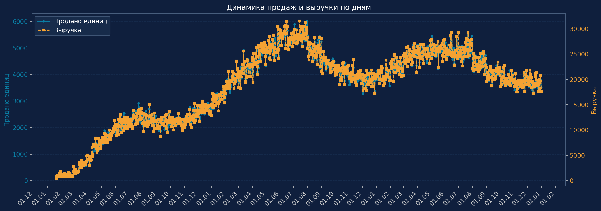
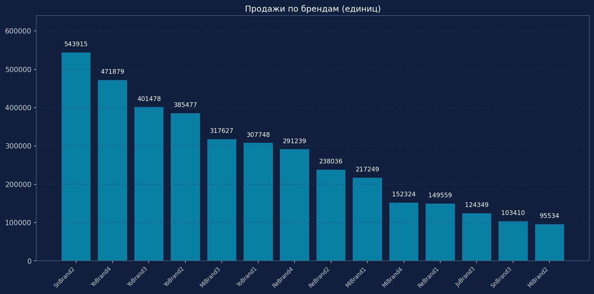
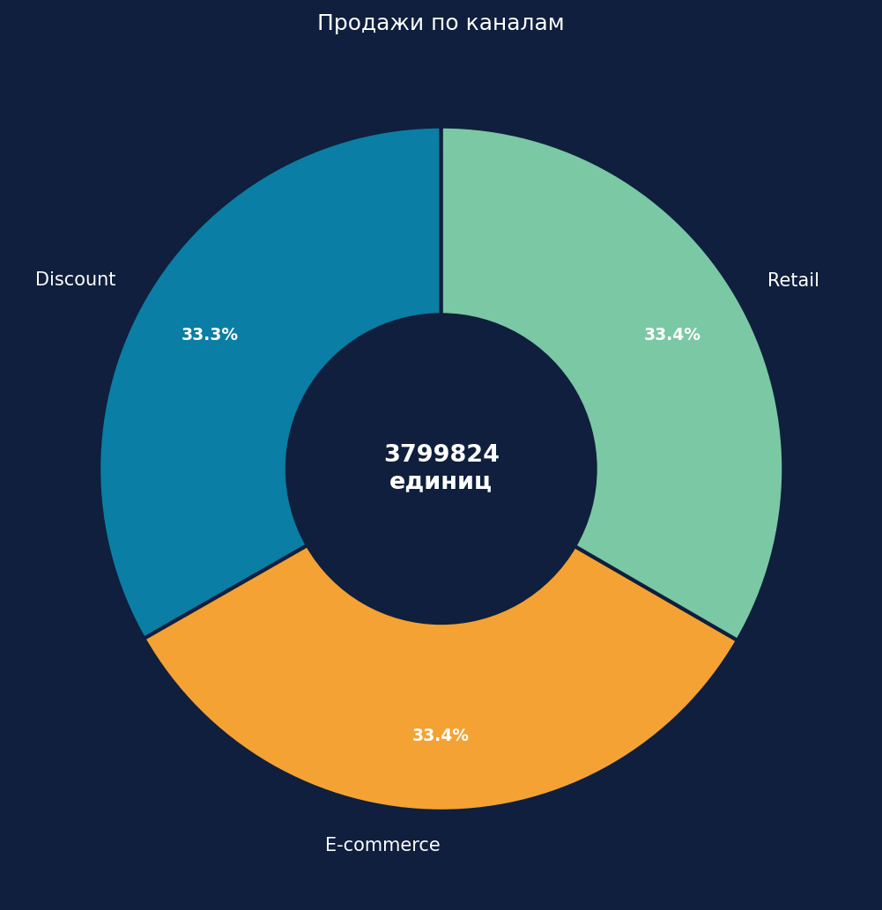
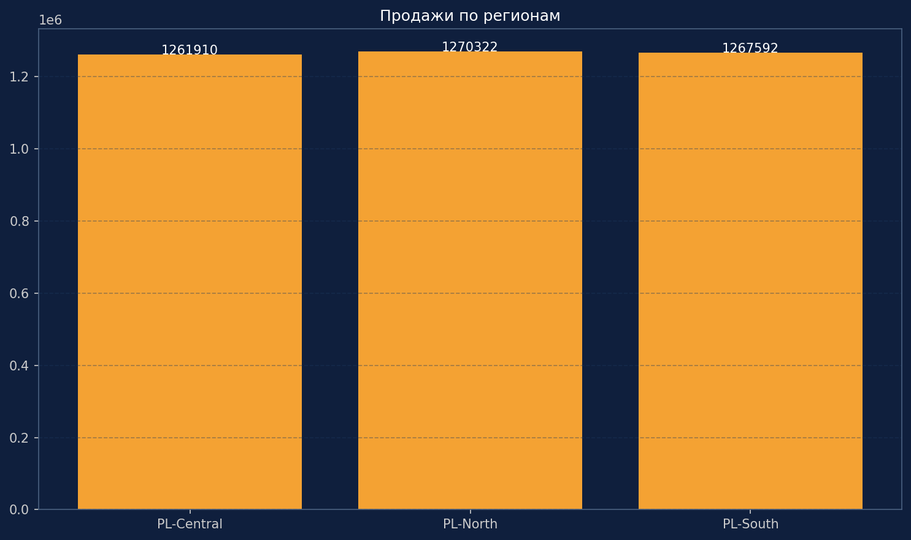
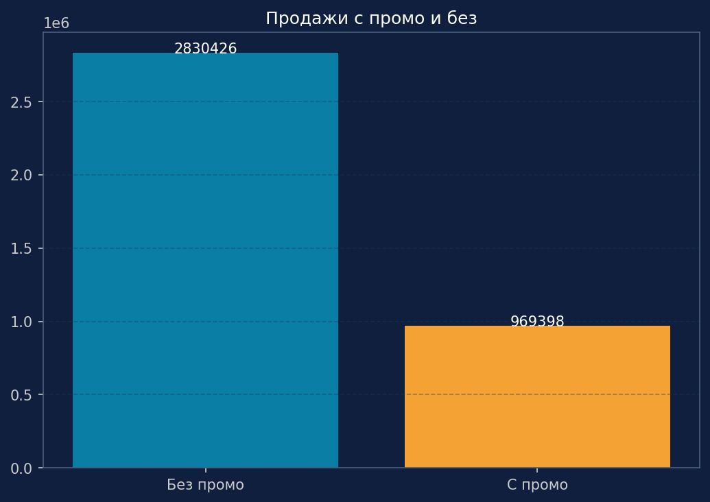
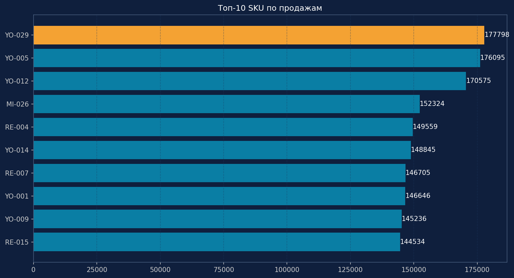
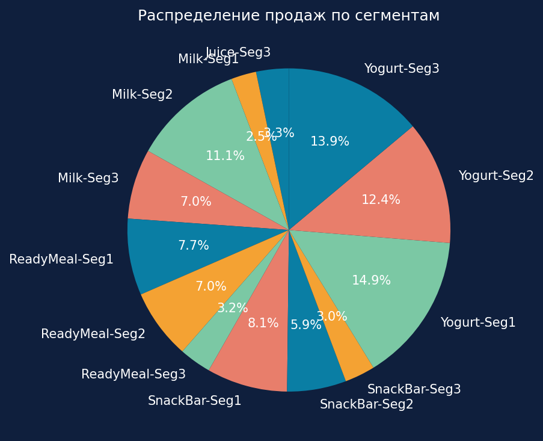
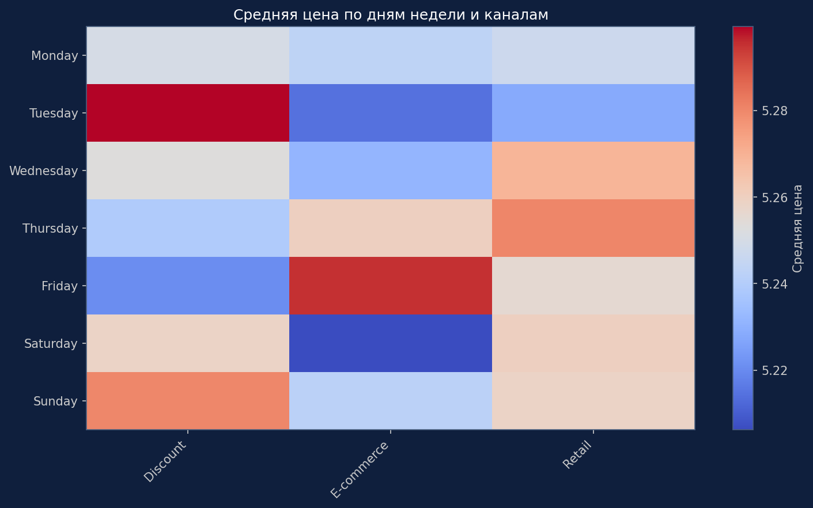

## Продуктовая аналитика 

## 🛒 FMCG Sales Dashboard — интерактивный дашборд ежедневных продаж сети FMCG.  
Проект из портфолио продуктового аналитика: анализ коммерческих данных и визуализация ключевых метрик на Python с тёмной темой. 

## 🎯 Цель 
Показать, как заменить Excel‑расчёты интерактивным дашбордом, создать профессиональную бизнес‑аналитику.

